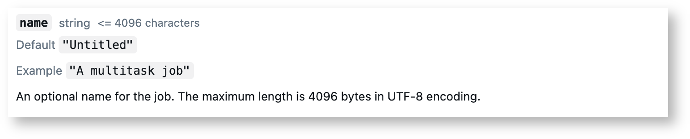
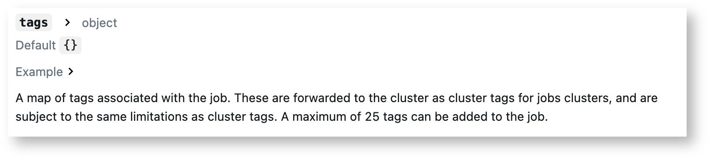
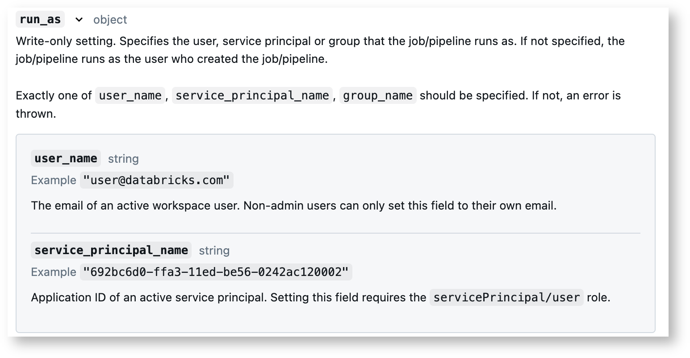
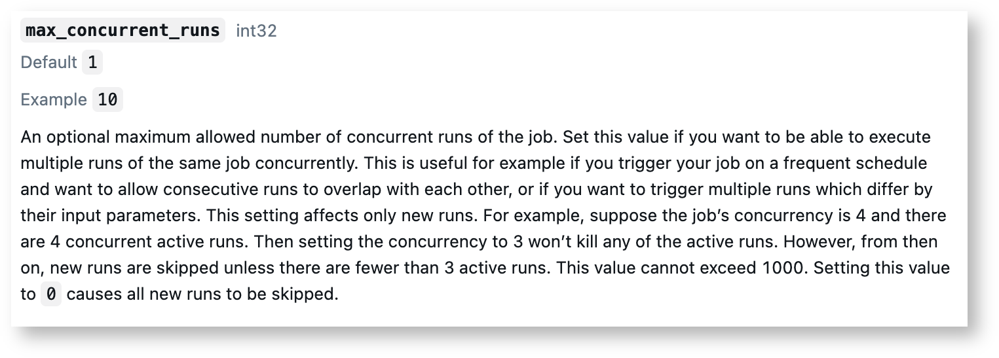

# Policies for workspace resources & services - proposal

## Context
We need the ability to restrict how users use our workspace better.  Tokens, workflows, DLT pipelines, vector search, model serving, and dashboards are all examples of things that we want our users to have access to but also put limits in place for how they use them.

Databricks does not currently give us a way to control how our user interact with a lot of these workspace-level resources such as workflow, DLT pipelines, etc, but they are all things we need governance on to prevent inappropriate operationalization without governance within the workspaces.  Databricks has recently given us *some* additional governance over token provisioning and use, but it's still too limited to meet all of our current needs around token governance.

## Proposal
### High-level overview
Ideally, for each workspace-level resource and service in Databricks that the API supports we'd be able to craft policies that dictate which/ resources/services users can provision and use as well as how they users can provision and use them.

For example, there is a need for some of our users to be able to create their own workflows in Databricks within the UI, but 1) not all users should have that ability and 2) the configuration for the workflows that users who *can* use workflows should be significantly more limited than it is right now.

Workflows can help our users reduce costs by pushing long and/or time-intensive code to run on cheaper job compute, but operationalizing their analytic models & workflows in production needs to be done by a full governed CI/CD process that can:
  1) Check for security issues (via Veracode)
  2) Ensure all production code is properly tested (both unit and integration tests)
  3) Ensure that workflows are being run by production SPs linked to Service Accounts with necessary access
  4) Ensure the proper audit and deployment logs are generated and stored
  5) Ensure all code is properly version controlled and code artifacts for each deployment properly stored and redundant
  6) Ensure that all necessary metadata, usage agreements, and approvals are in place prior to deploying
  7) Set appropriate TTL limits on workflows

The above list is not even exhaustive, but is detailed enough to highlight the *need* for a well-regulated governance system for both analytics operationalization and Databricks workflows in general to exist.  Without proper governance on workflows themselves, there will be nothing stopping teams from simply ignoring the operationalization process completely and directly creating ungoverned, unmonitored, and unaudited workflows from notebooks directly in the UI.


In this conception of a policy-based approach to resource/service management, a resource/service a principal (user, user group, or service principal) must be granted permissionto `USE` and/or `MANAGE` (or be a member of a user group with appropriate permissions to `USE` or `MANAGE`) to use said resource/service.  Any actions that interact involving the resource/service should be limited to actions/configuration explicitly defined as allowable under such a policy.  One appropriate approach to determing with resources/services are policy restricted is to use the same exact categorization of these resources and services that the API uses to interact with them.

For this example we will be showing possible policy examples governing workflows/jobs within Databricks (for the reasons outlined above).  The below sections break down example components of workflows/jobs that the policy should cover (again pulled directly from the available API fields) within an example "Jobs" policy we'd like to be able to create a new job.  The API endpoint to create a new job would take a large number of arguments, such as "name", "tags", "run_as", "max_concurrent_runs", and "schedule" – and all of these arguments should be parameterizable.

### Example policy statements for job/workflow governance

#### name
We only want users to create jobs with names that start with their team name.  For example, if we're making a policy for a team named "EXAMPLE_TEAM", we should be able to set the policy to restrict the job's name to a regex pattern.

Example statement:
```json
"name": {
  "pattern": "EXAMPLE_TEAM - \\w+",
  "type": "regex"
},
```
API field documentation:


#### tags
All jobs deployed with this policy should have an enforced Team  tag with their team name in it.  For the "EXAMPLE_TEAM" policy, any job deployed must have at least the tag a tag for team names annotated by 'Team'.

Example statement:
```json
"custom_tags.Team": {
  "type": "fixed",
  "value": "EXAMPLE_TEAM"
},
```
API field documentation:


#### run_as
All jobs deployed with this policy should disallow setting the user_name  field and enforce the service_principal_name  field to be the UUID of their team service principal.

Example statement:
```json
"run_as.user_name": {
  "type": "forbidden",
  "hidden": true
},
"run_as.service_principal_name": {
  "type": "fixed",
  "value": "692bc6d0-ffa3-11ed-be56-0242ac120002"
},
```
API field documentation:


#### max_concurrent_run
For the max_concurrent_runs  field, we should be able to set a minimum value, maximum value, and a default value.

Example statement:
```json
"max_concurrent_runs": {
  "hidden": false,
  "minValue": 1,
  "maxValue": 10,
  "type": "range",
},
```
API field documentation:


#### schedule
In order to ensure production code is properly governed and auditable, the operationalizing of any notebook in production (via a recurring schedule) needs to be prohibited to end users directly.  All operationalized production code needs to be defined and managed within a model governance framework so that it's easily governed and auditable, which requires deploying operationalized production code through CI/CD pipelines that ensure the code is properly tested (unit & integration), scanned (via Veracode), hosted/backed up in Artifactory, and that all deployment logs are stored to ensure full accountability of changes.

Given that, we don't want any EAP team to be able to schedule a job to run on a recurring schedule in productiono, all jobs created with this policy should only be manually triggerable.  To enforce this, `pause_status` will fixed to `PAUSE`.

Example statement:
```json
"schedule.pause_status": {
  "type": "fixed",
  "hidden": "PAUSED"
},
"schedule.timezone_id": {
  "defaultValue": "America/New_York",
  "type": "allowlist",
  "values": [
    "America/New_York",
    "America/Chicago",
    "America/Los_Angeles",
  ]
},
```
API field documentation:


### Summary
The above examples are just a small subset of the the overall functionality we'd want to govern for Databricks jobs and jobs is just a small subset of the overall services in Databricks we'd want to be able to craft and govern with policies, but they give a good overview of what the functionality should look like.

We already have the ability to craft policies for clusters and it works fantastically well, but the current Databricks landscape looks like the Wild Wild West for governing every single other workspace-level resource and service.

### Short-term governance solutions
There are solutions we can implement at our level to achieve similar functionality as above, but they aren't trivial solutions to implement, have a lot of moving pieces that we don't want to (or even feel we should) be responsible for.  Additionally, these would only be able to govern resources ex post facto -- which is horribly inefficient and is more vulnerable to abuse from bugs/failures due to needing the resource to exist prior to checking whether it's within governance guidelines.  The service policy feature recommended above would allow us to govern resources *prior* to their creation, which both saves resources and isn't vulnerable to allowing disallowed usage if the governance system faces an intermittent failure.

The overall system for governance we can implement now would require a few major components:
1) A spark streaming job that continually monitors the appropriate system table for events related to the resource/service we want to govern.
2) A framework for declaring restrictions in a policy-like document that the streaming job can use to compare new resource/service configuration against.  The monitor job would also need an efficient system for determining whether the principal (users, user groups, service principals) that is trying to use the service or create the resource with the appropriate configuration as well.
3) Additional job that monitors the actual policies in place and can identify and revalidate associated resource/services if a policy is updated or removed

The streaming monitor job itself would need to follow a workflow similar to this:
1) Trigger governance checks when new resource/service in system tables triggers.
2) Check the principal that is creating and/or updating said resource/service and determine which, if any, policies it is allowed to assume.  If no policies, immediately invalidate resource/service.
  - Invalidation needs to be well-defined and consistent across resources/services. At a minimum, it should:
    * shut down any resource/service currently being spun up or currently running
    * isolate or delete the inappropriate resource/service
    * notify user that their resource/service is not defined validly for the policies they have access to
3) Log action as allowed or invalidated for monitoring and auditing purposes.
  - Table should contain all metadata needed to easily identify deployed resources/services that may be affected if a specific policy has been updated or removed.
4) Tag resource/services appropriately to easily identify which have been confirmed valid and the specific governance job that reviewed it
